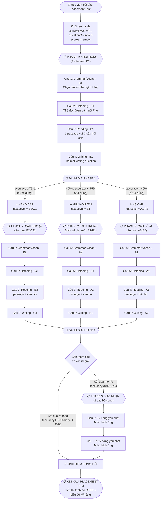

# LUỒNG BÀI THI ĐẦU VÀO THÍCH ỨNG (ADAPTIVE PLACEMENT TEST FLOW)

> **Phiên bản:** 1.0  
> **Ngày tạo:** 2026-06-02  
> **Tham chiếu:** [academic.md](./academic.md) | [academic_rules.md](./academic_rules.md)

---

## 1. TỔNG QUAN HỆ THỐNG

### 1.1 Mục tiêu
Đánh giá toàn diện 4 kỹ năng ngôn ngữ của học viên (Listening, Reading, Grammar/Vocabulary, Writing) trong thời gian ngắn nhất có thể (8-12 câu hỏi), sử dụng thuật toán thích ứng để phân loại chính xác trình độ CEFR (A1 → C2).

### 1.2 Nguyên tắc thiết kế
- **Tiết kiệm thời gian:** Tối đa 10 câu (mở rộng 8-12), không quá 15-20 phút.
- **Đảm bảo đa dạng kỹ năng:** Mỗi kỹ năng có tối thiểu 1 câu, tối đa 4 câu.
- **Thích ứng động (Adaptive):** Câu hỏi tiếp theo phụ thuộc vào kết quả câu trước đó.
- **Ngẫu nhiên hóa:** Câu hỏi được chọn random từ ngân hàng đề theo cấp độ.

---

## 2. SƠ ĐỒ LUỒNG BÀI THI (FLOWCHART)



---

## 3. CHI TIẾT THUẬT TOÁN THÍCH ỨNG (ADAPTIVE ALGORITHM)

### 3.1 Trạng thái bài thi (Test State)

```javascript
const testState = {
    currentPhase: 1,           // Phase hiện tại (1, 2, hoặc 3)
    currentLevel: 'B1',        // Level hiện tại đang test
    questionCount: 0,          // Tổng số câu đã làm
    maxQuestions: 10,           // Giới hạn tối đa (có thể 8-12)

    // Điểm chi tiết theo kỹ năng
    skillScores: {
        listening:    { correct: 0, total: 0, levels: [] },
        reading:      { correct: 0, total: 0, levels: [] },
        grammar_vocab:{ correct: 0, total: 0, levels: [] },
        writing:      { correct: 0, total: 0, levels: [] }
    },

    // Lịch sử câu hỏi đã dùng (tránh trùng)
    usedQuestionIds: [],

    // Lịch sử chi tiết (lưu Firebase)
    detailedResults: []
    // Format: { questionId, skill, level, isCorrect, timestamp }
};
```

### 3.2 Hàm chọn câu hỏi ngẫu nhiên

```
FUNCTION selectRandomQuestion(skill, level, usedIds):
    1. Nạp ngân hàng câu hỏi từ file JSON tương ứng:
       → json/placement/{skill}-{level}.json
    2. Lọc bỏ các câu đã dùng (usedIds)
    3. Chọn ngẫu nhiên 1 câu (Fisher-Yates random)
    4. Thêm ID câu đã chọn vào usedIds
    5. Trả về câu hỏi
```

### 3.3 Logic rẽ nhánh sau mỗi Phase

```
FUNCTION evaluatePhase(phaseResults):
    correctCount = đếm số câu đúng trong phase
    totalCount = tổng số câu trong phase
    accuracy = correctCount / totalCount

    IF accuracy >= 0.75:
        → Rẽ nhánh NÂNG CẤP
        → Phase tiếp theo dùng level cao hơn 1-2 bậc
        
    ELSE IF accuracy >= 0.40:
        → Rẽ nhánh GIỮ NGUYÊN
        → Phase tiếp theo test lại mức thấp hơn 1 bậc để tìm nút thắt
        
    ELSE (accuracy < 0.40):
        → Rẽ nhánh HẠ CẤP
        → Phase tiếp theo chuyển xuống câu dễ nhất
```

### 3.4 Bảng rẽ nhánh chi tiết

| Phase 1 Result | Phase 2 Level | Phase 2 Result | Phase 3 (nếu cần) | Kết quả cuối |
|:---:|:---:|:---:|:---:|:---:|
| ≥ 75% (Giỏi) | B2 + C1 | ≥ 75% | Không cần | **C1 hoặc C2** |
| ≥ 75% (Giỏi) | B2 + C1 | 40-74% | Không cần | **B2** |
| ≥ 75% (Giỏi) | B2 + C1 | < 40% | 2 câu B1 | **B1** |
| 40-74% (TB) | A2 + B1 | ≥ 75% | Không cần | **B1** |
| 40-74% (TB) | A2 + B1 | 40-74% | 2 câu A2 | **A2 hoặc B1** |
| 40-74% (TB) | A2 + B1 | < 40% | Không cần | **A1 hoặc A2** |
| < 40% (Yếu) | A1 + A2 | ≥ 75% | 2 câu B1 | **A2 hoặc B1** |
| < 40% (Yếu) | A1 + A2 | 40-74% | Không cần | **A2** |
| < 40% (Yếu) | A1 + A2 | < 40% | Không cần | **A1** |

---

## 4. QUY TẮC CHỌN CÂU HỎI THEO KỸ NĂNG

### 4.1 🎧 Kỹ năng Nghe (Listening)
- **Cách hoạt động:**
  1. Hệ thống chọn ngẫu nhiên 1 câu hỏi từ ngân hàng Listening theo level hiện tại.
  2. Hiển thị nút **▶️ Play** — KHÔNG hiển thị đoạn văn bản (`audioText`).
  3. Khi bấm Play, sử dụng **hàm `speakEnglish()` có sẵn** trong `state.js` (SpeechSynthesis, giọng en-US, rate 0.85) để đọc trường `audioText`.
  4. Học viên nghe rồi chọn đáp án từ 4 lựa chọn.
  5. Cho phép nghe lại tối đa **2 lần** (tổng 3 lần nghe).

- **Cấp độ khó:**
  | Level | Đặc điểm audio |
  |:---:|:---|
  | A1-A2 | Câu ngắn 1-2 dòng, từ vựng cơ bản, tốc độ chậm |
  | B1-B2 | Hội thoại 3-4 câu, phrasal verbs, tốc độ bình thường |
  | C1-C2 | Đoạn độc thoại/bài giảng, từ học thuật, tốc độ nhanh |

### 4.2 📖 Kỹ năng Đọc (Reading)
- **Cách hoạt động:**
  1. Chọn ngẫu nhiên 1 **passage** (đoạn văn) từ ngân hàng Reading theo level.
  2. Hiển thị đoạn văn cho học viên đọc.
  3. Hiển thị lần lượt **2-4 câu hỏi** liên quan đến passage đó.
  4. Tất cả câu hỏi con của cùng passage được tính là **1 block** trong bài thi.
  5. Điểm Reading = trung bình điểm các câu hỏi con.

- **Cấp độ khó:**
  | Level | Đặc điểm passage |
  |:---:|:---|
  | A1-A2 | 2-3 câu đơn giản, thông tin tường minh |
  | B1-B2 | 1 đoạn văn trung bình, cần suy luận nhẹ |
  | C1-C2 | Đoạn văn dài, ẩn dụ, cần suy luận sâu |

### 4.3 🔤 Kỹ năng Ngữ pháp / Từ vựng (Grammar & Vocabulary)
- **Cách hoạt động:**
  1. Chọn ngẫu nhiên 1 câu hỏi từ ngân hàng Grammar/Vocab theo level.
  2. Các dạng bài: Hoàn thành câu, Sửa lỗi sai, Chọn từ đúng.
  3. Hiển thị câu hỏi + 4 lựa chọn.

- **Cấp độ khó:**
  | Level | Đặc điểm |
  |:---:|:---|
  | A1-A2 | Thì đơn giản, từ vựng cơ bản, từ loại |
  | B1-B2 | Thì hoàn thành, câu điều kiện, collocations |
  | C1-C2 | Đảo ngữ, câu giả định, từ vựng học thuật hiếm |

### 4.4 ✍️ Kỹ năng Viết (Writing - Indirect)
- **Cách hoạt động:**
  1. Chọn ngẫu nhiên 1 câu hỏi từ ngân hàng Writing (đa dạng dạng bài).
  2. **4 dạng bài** theo `academic.md` Phần 4:
     - **Error Identification:** Tìm lỗi sai trong câu.
     - **Sentence Transformation:** Viết lại câu.
     - **Paragraph Coherence:** Sắp xếp câu thành đoạn.
     - **Open Cloze:** Điền từ tự do (gõ tay).
  3. Mỗi câu Writing vẫn thuộc dạng trắc nghiệm hoặc điền ngắn để chấm tự động.

---

## 5. PHƯƠNG PHÁP CHẤM ĐIỂM VÀ TÍNH TRÌNH ĐỘ

### 5.1 Công thức tính điểm theo trọng số

Dựa trên `academic.md` Phần 3, Cách 2 (Multi-stage Adaptive Test), kết hợp trọng số:

```
Điểm kỹ năng (Sub-score) = (Số câu đúng / Tổng câu) × 100  (mỗi kỹ năng)

Điểm tổng trọng số = 
    (Điểm_Listening × 0.30) + 
    (Điểm_Reading × 0.30) + 
    (Điểm_Grammar_Vocab × 0.20) + 
    (Điểm_Writing × 0.20)
```

> **Lý do trọng số:** Listening và Reading là kỹ năng tiếp nhận ngôn ngữ thực tế, phản ánh chính xác nhất trình độ sử dụng ngôn ngữ hàng ngày.

### 5.2 Bảng quy đổi CEFR (Adaptive Test)

Vì bài test thích ứng, trình độ cuối cùng được xác định bằng **level cao nhất mà học viên đạt ≥ 60% accuracy** kết hợp với **level câu hỏi đã được gán**:

```javascript
function calculateCEFR(testState) {
    const { skillScores, detailedResults } = testState;
    
    // 1. Tính sub-score từng kỹ năng (0-100)
    const listeningPct  = (skillScores.listening.correct / skillScores.listening.total) * 100;
    const readingPct    = (skillScores.reading.correct / skillScores.reading.total) * 100;
    const grammarPct    = (skillScores.grammar_vocab.correct / skillScores.grammar_vocab.total) * 100;
    const writingPct    = (skillScores.writing.correct / skillScores.writing.total) * 100;
    
    // 2. Tính weighted total
    const weightedTotal = (listeningPct * 0.30) + (readingPct * 0.30) + 
                          (grammarPct * 0.20) + (writingPct * 0.20);
    
    // 3. Xác định level cao nhất đạt được
    const maxLevelReached = getHighestCorrectLevel(detailedResults);
    
    // 4. Kết hợp weighted score + max level để ra CEFR
    return determineFinalCEFR(weightedTotal, maxLevelReached);
}
```

### 5.3 Ma trận quy đổi CEFR cuối cùng

| Weighted Score | Level câu khó nhất đúng | Trình độ CEFR |
|:---:|:---:|:---:|
| ≥ 85% | C1/C2 | **C2 - Thành thạo** |
| ≥ 75% | C1/C2 | **C1 - Cao cấp** |
| ≥ 65% | B2/C1 | **B2 - Trung cấp cao** |
| ≥ 55% | B1/B2 | **B1 - Trung cấp** |
| ≥ 45% | A2/B1 | **A2 - Sơ cấp cao** |
| < 45% | A1/A2 | **A1 - Sơ cấp** |

### 5.4 Dữ liệu lưu trữ (Firestore)

Theo hướng dẫn `academic.md` Phần 💡, kết quả được lưu chi tiết vào **Firestore** (phù hợp vì dự án đã dùng Firestore cho toàn bộ dữ liệu người dùng trong `firebase-sync.js`):

```javascript
// Lưu vào Firestore: /users/{uid}/placement_results/{testId}
const placementResult = {
    userId: "USER_ID",
    testDate: new Date().toISOString(),
    totalQuestions: 10,
    
    // Kết quả tổng
    finalCEFR: "B1",
    weightedScore: 62.5,
    
    // Kết quả chi tiết theo kỹ năng
    skillBreakdown: {
        listening:     { score: 75,  level: "B1", questionsCorrect: 2, questionsTotal: 2 },
        reading:       { score: 66,  level: "B1", questionsCorrect: 2, questionsTotal: 3 },
        grammar_vocab: { score: 50,  level: "A2", questionsCorrect: 1, questionsTotal: 2 },
        writing:       { score: 50,  level: "A2", questionsCorrect: 1, questionsTotal: 2 }
    },
    
    // Lịch sử từng câu (fine-grained) theo format academic.md
    // [User_ID] | [Question_ID] | [Skill] | [Level] | [Status]
    questionHistory: [
        { questionId: "pl-gv-b1-003", skill: "grammar_vocab", level: "B1", isCorrect: true },
        { questionId: "pl-l-b1-007",  skill: "listening",     level: "B1", isCorrect: true },
        // ...
    ]
};
```

---

## 6. QUY TẮC ĐẢM BẢO CHẤT LƯỢNG

### 6.1 Ràng buộc phân bổ kỹ năng

Trong **mỗi bài test** (bất kể số câu cuối cùng là 8, 10 hay 12), phải đảm bảo:

| Kỹ năng | Số câu tối thiểu | Số câu tối đa |
|:---:|:---:|:---:|
| Listening | 1 | 3 |
| Reading | 1 (= 1 passage) | 3 (= 3 passages) |
| Grammar/Vocab | 2 | 4 |
| Writing | 1 | 3 |

### 6.2 Thứ tự ưu tiên chọn kỹ năng

Khi cần thêm câu bổ sung (Phase 3), ưu tiên chọn **kỹ năng có ít câu nhất** hoặc **kỹ năng có kết quả mơ hồ nhất** (accuracy gần 50%) để xác nhận chính xác hơn.

### 6.3 Xử lý đặc biệt cho Reading

Vì mỗi passage Reading có 2-4 câu hỏi con, nên:
- Passage được đếm là **1 câu** trong ngân sách tổng bài thi.
- Nhưng khi tính điểm kỹ năng Reading, tính trung bình tất cả câu hỏi con.
- VD: 1 passage B1 có 3 câu hỏi, học viên trả lời đúng 2/3 → Reading accuracy = 66.7%.

---

## 7. CẤU TRÚC NGÂN HÀNG CÂU HỎI (FILE JSON)

### 7.1 Cấu trúc thư mục

```
json/placement/
├── placement-index.json          ← Index tổng (ID + skill + level mapping)
├── listening-a1.json
├── listening-a2.json
├── listening-b1.json
├── listening-b2.json
├── listening-c1.json
├── listening-c2.json
├── reading-a1.json
├── reading-a2.json
├── reading-b1.json
├── reading-b2.json
├── reading-c1.json
├── reading-c2.json
├── grammar-vocab-a1.json
├── grammar-vocab-a2.json
├── grammar-vocab-b1.json
├── grammar-vocab-b2.json
├── grammar-vocab-c1.json
├── grammar-vocab-c2.json
└── writing-placement.json
```

### 7.2 Hệ thống Index (`placement-index.json`)

File index nhẹ chứa metadata của toàn bộ ngân hàng câu hỏi, cho phép:
- **Tra cứu nhanh** câu hỏi theo skill + level mà không cần tải toàn bộ file JSON
- **Mapping Firestore collection** — mỗi file JSON tương ứng 1 Firestore collection riêng biệt
- **ID không trùng lặp** — mọi câu hỏi có prefix riêng: `pl-l-` (listening), `pl-r-` (reading), `pl-gv-` (grammar/vocab), `pl-w-` (writing)

### 7.3 Nguồn dữ liệu kép (Dual Data Source)

File JS placement test sẽ hỗ trợ **2 nguồn dữ liệu**, theo pattern đã có trong `firebase-sync.js`:

```javascript
async function fetchPlacementQuestions(skill, level) {
    // 1. Thử tải từ Firestore trước (nếu đã cấu hình)
    if (window.FirebaseSync && window.FirebaseSync.isConfigured) {
        try {
            const collectionName = `placement_${skill}_${level}`;
            const snap = await getDocs(collection(db, collectionName));
            const items = [];
            snap.forEach(d => items.push({ id: d.id, ...d.data() }));
            if (items.length > 0) return items;
        } catch (e) {
            console.warn(`Firestore placement fetch failed for ${skill}/${level}, falling back to local`);
        }
    }
    
    // 2. Fallback: Tải từ file JSON local
    try {
        const index = await fetch('json/placement/placement-index.json').then(r => r.json());
        const fileInfo = index.skills[skill][level];
        if (!fileInfo) return [];
        const response = await fetch(fileInfo.file);
        return await response.json();
    } catch (e) {
        console.error(`Local placement fetch failed for ${skill}/${level}:`, e);
        return [];
    }
}
```

### 7.2 Schema chi tiết từng loại

#### Listening Question Schema
```json
{
  "id": "pl-l-{level}-{number}",
  "skill": "listening",
  "level": "A1|A2|B1|B2|C1|C2",
  "audioText": "String - Đoạn văn để TTS đọc (ẩn khỏi UI)",
  "question": "String - Câu hỏi hiển thị sau khi nghe",
  "options": ["String × 4 lựa chọn"],
  "answer": "Number (0-3) - index đáp án đúng",
  "explanation": "String - Giải thích đáp án bằng tiếng Việt"
}
```

#### Reading Question Schema
```json
{
  "id": "pl-r-{level}-{number}",
  "skill": "reading",
  "level": "A1|A2|B1|B2|C1|C2",
  "passage": "String - Đoạn văn đọc hiểu (hiển thị cho học viên)",
  "questions": [
    {
      "id": "pl-r-{level}-{number}-q{n}",
      "question": "String - Câu hỏi",
      "options": ["String × 4"],
      "answer": "Number (0-3)",
      "explanation": "String"
    }
  ]
}
```

#### Grammar/Vocabulary Question Schema
```json
{
  "id": "pl-gv-{level}-{number}",
  "skill": "grammar_vocab",
  "level": "A1|A2|B1|B2|C1|C2",
  "type": "sentence_completion|error_correction|word_choice",
  "question": "String - Câu hỏi",
  "options": ["String × 4"],
  "answer": "Number (0-3)",
  "explanation": "String"
}
```

#### Writing Question Schema
```json
{
  "id": "pl-w-{level}-{number}",
  "skill": "writing",
  "level": "A1|A2|B1|B2|C1|C2",
  "type": "error_identification|sentence_transformation|paragraph_coherence|open_cloze",
  "question": "String - Câu hỏi",
  "options": ["String × 4 (null cho open_cloze)"],
  "answer": "Number (0-3) hoặc String (cho open_cloze)",
  "explanation": "String"
}
```

---

## 8. TÍCH HỢP KỸ THUẬT

### 8.1 Hệ thống TTS (Phần Listening) — Sử dụng hàm `speakEnglish()` có sẵn

Tái sử dụng hàm [`speakEnglish(text)`](file:///Users/minhchau/Documents/GitHub/LearningEnglish/js/state.js#L206-L225) đã có trong `state.js`:

```javascript
// Hàm có sẵn trong state.js — KHÔNG cần tạo mới
function speakEnglish(text) {
    if ('speechSynthesis' in window) {
        window.speechSynthesis.cancel();
        const utterance = new SpeechSynthesisUtterance(text);
        utterance.lang = 'en-US';
        utterance.rate = 0.85;   // Tốc độ hơi chậm cho người học
        utterance.pitch = 1.0;
        const voices = window.speechSynthesis.getVoices();
        const idealVoice = voices.find(v => v.lang.includes('en-US') && v.name.toLowerCase().includes('google'));
        if (idealVoice) utterance.voice = idealVoice;
        window.speechSynthesis.speak(utterance);
    }
}

// Gọi trong placement test:
function playListeningAudio(audioText) {
    speakEnglish(audioText);  // Sử dụng hàm có sẵn
}
```

### 8.2 Giới hạn số lần nghe

```javascript
const MAX_PLAYS = 3;  // Tối đa 3 lần nghe (1 lần đầu + 2 lần replay)
let playCount = 0;

function handlePlayButton() {
    if (playCount < MAX_PLAYS) {
        playListeningAudio(currentQuestion.audioText);
        playCount++;
        updatePlayButtonUI(MAX_PLAYS - playCount);  // Hiển thị số lần còn lại
    } else {
        disablePlayButton();  // Vô hiệu hóa nút Play
    }
}
```

---

## 9. UX/UI FLOW

### 9.1 Màn hình bài thi

```
┌─────────────────────────────────────────┐
│  📋 Bài Test Đánh Giá Trình Độ          │
│  Câu 2/10          ⏱️ 00:03:24          │
│  ─────────────────────────────────────  │
│                                         │
│  🎧 LISTENING                           │
│                                         │
│  Nghe đoạn hội thoại và trả lời câu    │
│  hỏi bên dưới:                          │
│                                         │
│       ┌──────────────────┐              │
│       │   ▶️ Play Audio   │  (2 lượt    │
│       │                  │   còn lại)   │
│       └──────────────────┘              │
│                                         │
│  Where is the woman going?              │
│                                         │
│  ○ A. To the library                    │
│  ● B. To the supermarket               │
│  ○ C. To the hospital                  │
│  ○ D. To the post office               │
│                                         │
│  ┌─────────────┐  ┌─────────────┐      │
│  │  ← Quay lại │  │ Tiếp theo → │      │
│  └─────────────┘  └─────────────┘      │
└─────────────────────────────────────────┘
```

### 9.2 Màn hình kết quả

```
┌─────────────────────────────────────────┐
│  🎉 Kết Quả Bài Test Đầu Vào           │
│  ─────────────────────────────────────  │
│                                         │
│     Trình Độ Của Bạn: B1               │
│     Trung Cấp (Intermediate)            │
│                                         │
│  ┌─────────────────────────────────┐    │
│  │  📊 Biểu đồ Radar 4 kỹ năng   │    │
│  │                                 │    │
│  │    Listening: ████████░░ 80%    │    │
│  │    Reading:   ██████░░░░ 60%    │    │
│  │    Grammar:   █████░░░░░ 50%    │    │
│  │    Writing:   █████░░░░░ 50%    │    │
│  └─────────────────────────────────┘    │
│                                         │
│  Điểm tổng trọng số: 62.5/100          │
│                                         │
│  💡 Nhận xét: Kỹ năng Nghe của bạn     │
│  rất tốt! Hãy tập trung cải thiện      │
│  Ngữ pháp và Viết để nâng trình độ.    │
│                                         │
│  ┌──────────────────────────────┐       │
│  │  🚀 Bắt Đầu Hành Trình Học  │       │
│  └──────────────────────────────┘       │
└─────────────────────────────────────────┘
```

---

## 10. TƯƠNG THÍCH VỚI HỆ THỐNG HIỆN TẠI

### 10.1 Tương thích ngược (Backward Compatibility)

> **Quy tắc:** Giữ nguyên kết quả cũ của học viên đã làm placement test 16 câu. Nếu học viên làm lại placement test mới, kết quả sẽ được cập nhật.

```javascript
// Kiểm tra học viên đã có kết quả placement test chưa
if (state.lastTestScore > 0 && state.userLevel !== 'A1') {
    // Học viên đã có kết quả cũ → giữ nguyên, hiển thị option "Làm lại test"
    showRetakeButton();
} else {
    // Học viên mới → bắt buộc làm placement test
    startPlacementTest();
}
```

### 10.2 Mapping sang `state.placementStats`

Sau khi hoàn thành placement test mới, kết quả sẽ được map sang cấu trúc `placementStats` hiện có trong `academic_rules.md`:

```javascript
state.placementStats = {
    grammar:   Math.round((grammarPct / 100) * 4),    // Quy đổi về thang 0-4
    reading:   Math.round((readingPct / 100) * 4),
    vocab:     Math.round((grammarPct / 100) * 4),     // Grammar/Vocab chung
    listening: Math.round((listeningPct / 100) * 4)
};
```

### 10.3 Mapping sang bảng CEFR 8 mức

Kết quả CEFR 6 mức (A1-C2) từ bài test mới sẽ được map sang bảng 8 mức trong `academic_rules.md`:

| Test mới | Mapping cũ | Tên hiển thị |
|:---:|:---:|:---|
| A1 | A1 | Sơ cấp (A1) |
| A2 | A2 hoặc A3 | Sơ cấp (A2) / Tiền trung cấp (A3) |
| B1 | B1 | Trung cấp (B1) |
| B2 | B2 hoặc B3 | Trung cấp (B2) / Tiền cao cấp (B3) |
| C1 | C1 | Cao cấp (C1) |
| C2 | C2 | Thành thạo (C2) |

> Để phân biệt A2/A3 và B2/B3, hệ thống dùng thêm weighted score: nếu score ≥ 50% trong nhóm thì lên A3 hoặc B3.
